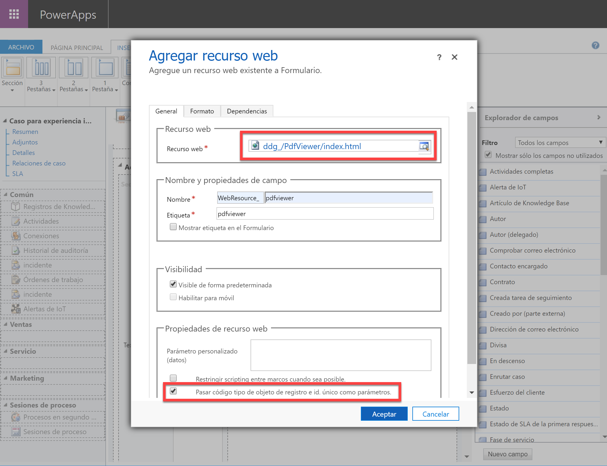

# dd-crm-pdfviewer
Pdf viewer for Dynamics CRM

## Description

Simple PDF Viewer for CRM Dynamics.
You will be able to add a PDF Viewer in a few minuts without any development, just customization.

## Download

Download the latest version from the repository
[Release](https://github.com/ddgranizo/dd-crm-pdfviewer/tree/master/release/)


## Setup

1. Import latest version of Managed Solution


2. Wait to complete the import


3. Add new web resource to your Form


4. Setup de webresource



5. Save and publish


6. Check the viewer in a record


## Settings

It's possible to customize the behaviour of the tool by this settings:

* **scale** (decimal): defines the scale of the rendered image. Default value: 1
* **crmVersion** (string): defines the version of the API for the requests. Default value : "9.1"
* **messages.cantLoadAnyPdfTitle** (string): label. Default value: "Can't load any PDF"
* **messages.saveFirstText** (string): label. Default value: "Save first the record. Then reload the page."
* **messages.passCrmContextText** (string): label. Default value: "Set the 'Pass context parameters' checked in the form editor for this webresource"
* **messages.foundZeroDocuments** (string): label. Default value: "Can't find any PDF in this record. Use annotations to attach PDFs"
* **messages.loadingFiles** (string): label. Default value: "Loading PDFs..."
* **messages.errorTitle** (string): label. Default value: "Error"

Use a valid JSON for include your custom settings. Include only the settings you need.
Example of valid JSON
```
{
    "crmVersion": "9.1",
    "scale": 1.5,
    "messages": {
        "cantLoadAnyPdfTitle": "Can't load any PDF",
        "saveFirstText": "Save first the record. Then reload the page.",
        "passCrmContextText": "Set the 'Pass context parameters' checked in the form "editor for this webresource",
        "foundZeroDocuments": "Can't find any PDF in this record. Use annotations to "attach PDFs",
        "loadingFiles": "Loading PDFs...",
        "errorTitle": "Error",
    }
}
```

Paste it in the "Customizations parameters" box then adding the WebResource


## License

Open Source. Free for everyone.

Collaboration with pull request will be appreciated! :metal:

## Third libraries


 - Mozilla PDF - https://github.com/mozilla/pdf.js

 - Font Awesome - https://fontawesome.com

 - AngularJS - https://angularjs.org/

 - Bootstrap - https://getbootstrap.com/

 - JQuery - https://jquery.com/

 - Jasmine - https://jasmine.github.io/

 - Karma - https://karma-runner.github.io/latest/index.html

